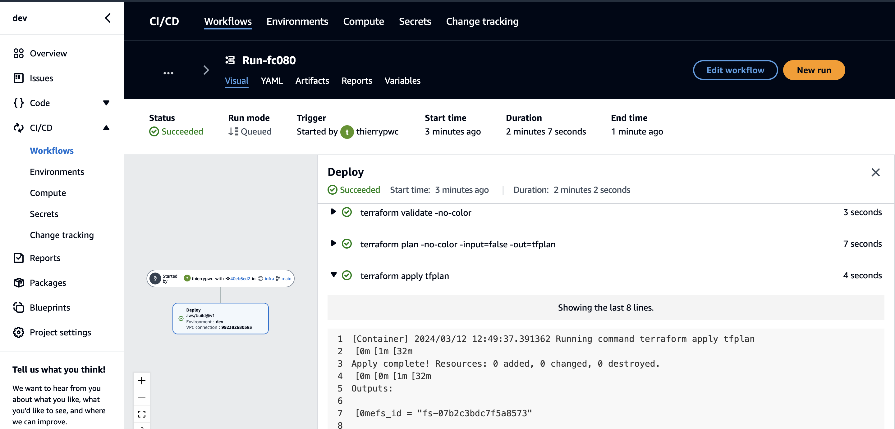

# infra

## Deployment guide
All deployments are maintained by the CodeCatalyst [workflows](https://codecatalyst.aws/spaces/digit-b2/projects/dev/workflows?repositoryName=All+repositories&branchName=All+branches&activeTabId=workflows) defined in the space: `digit-b2`.  

Each of the code repositories has a workflow defined.  
The frontend and backend deployments essentially push a Docker image to the ECR repository.
The infrastructure is deployed by workflow defined in this repository.

#### Resources created manually
* Amazon CodeCatalyst space
* QuickSight subscription 
* Domain registration

Those resources are typically created manually because human interaction is needed and lack of automation capabilities.

Note, since the project is at a POC (Proof of Concept) or MVP (Minimum Viable Product) stage, the registered domain **semeiceu.ai** does not have auto-renewal enabled.

#### Terraform bootstrap 
In order to have the remote state management correctly bootstrapped, a separate folder with the objects has been created. 
This can be found under aws/bootstrap. For those objects the terraform state `terraform.tfstate` is stored inside this repository.

It is sufficient, to run the `terraform apply` command from inside the folder:

```bash
[mde-user@ip-10-130-65-188 bootstrap]$ terraform output
bucket_id = "digit-semic-dev-terraform-state"
ddb_table_id = "digit-semic-dev-terraform-state"
```
This returns the bucket and dynamodb table to be used for the `aws/dev` objects to be created.

Those elements are used in the configuration of the backend in the file: `aws/dev/backend.tf`:

```terraform
terraform {
  backend "s3" {
    bucket         = "digit-semic-dev-terraform-state"
    key            = "aws/dev/terraform.tfstate"
    region         = "eu-west-1"
    dynamodb_table = "digit-semic-dev-terraform-state"
  }
}

```

#### Terraform Infra deployment
All configuration is done via the `aws/dev/vars.tf` file.  

The file contains multiple sections for the different resources. Most variables have a default value foreseen. Except for the variables: `frontend_image` and `backend_image`.
The deployed ECS tasks will by default use the latest version tag found the respective ecr repositories: `digit-semic-dev-frontend` and `digit-semic-dev-backend`. Note the image tag also corresponds to the GIT tag.
If for some reason, we would like to deploy a different version of the images, this can be done via those variables.
Example of reverting the front-end to a version: `v0.0.27`: 

```terraform
variable "frontend_image" {
  type        = string
  default     = "***.dkr.ecr.eu-west-1.amazonaws.com/digit-semic-dev-frontend:v0.0.27"
  description = "Only provide a value, if you want to deploy the non-latest tag found"
}
```

Variables referencing manually deployed resources, the values can be found in AWS console.

```terraform
# CodeCatalyst variables
variable "codecatalyst_space_id" {
  type    = string
  default = "9ce68442-fd01-4765-9ec0-8f0502a4cf9d"
}

variable "codecatalyst_project_id" {
  type        = string
  default     = "6915d749-8a30-4a17-9dc2-fa8508829c1e"
  description = "The project ID that will be granted the Terraform role"
}

# DNS, using the hosted zone provided by the domain registration
variable "public_zone" {
  default = {
    id     = "Z02659241HH5QDM4SNKZ6"
    domain = "semicai.eu"
  }
}
```


#### Deployment of the ECS tasks and services
If a new version of the frontend or backend has been pushed to ECR and this version can be deployed to ECS.
Ensure the variables `frontend_image` and `backend_image` are empty. And trigger an Infra workflow from the CodeCatalyst Workflows UI by pressing the button "New Run":



